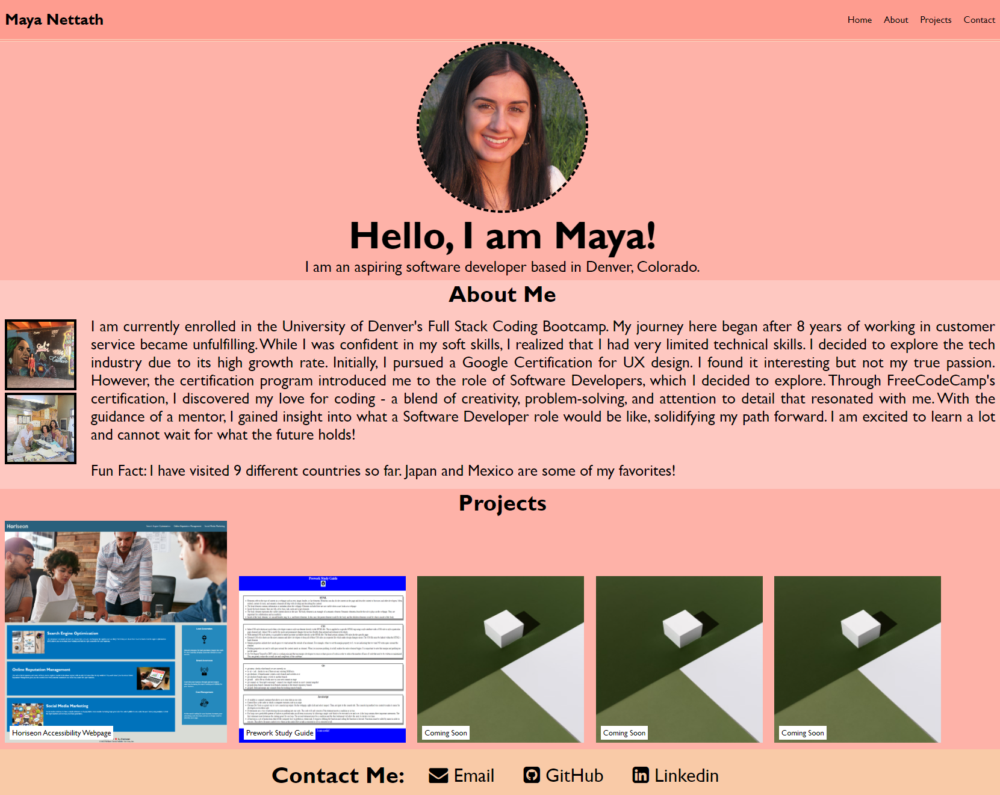

# personal-portfolio

## Description

I created this personal portfolio so that potential employers can see what I have accomplished. Employers can view my previous projects, learn more about me and get in contact. Creating this portfolio helped solve the problem of having many projects stored in different places where not everyone can see them. Additionally, I wanted this portfolio to have a responsive layout that adapts to the viewport. This is important because my portfolio may be viewed on different types of devices. While working on this project, I learned how to use the root selector and css variables to efficiently apply a theme to my webpage. I also familiarized myself with media queries to adjust how content is displayed, depending on screen size.

## Installation

N/A

## Usage

When a viewer loads this personal portfolio in their browser, they will first see a navigation bar and a home screen. The navigation bar can be used to automatically scroll to different sections of the portfolio. These sections include: Home, About, Projects, and Contact. When in the Projects section, viewers can view past projects with titles. To see the project in a live browser, the viewer just needs to click on the respective box. Lastly, when viewers go to the Contact section, they can hover over the options to email me, view my GitHub, or connect on Linkedin. These items become highlighted when hovered over.

## Credits

N/A

## License

N/A
